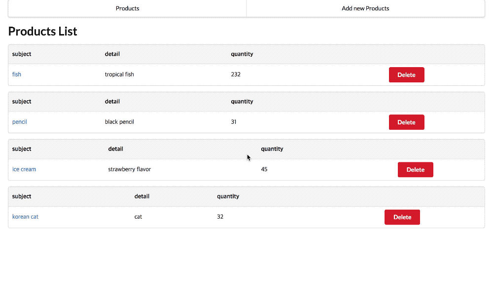

# node.js와 react-redux를 활용한 상품관리 application 개발

#### This app was built with 
- express
- mongodb
- react.js
- redux
- react-router
- redux-thunk
- redux-devtool
- semantic ui

## Quick Start
#### Run React App (Frontend)
* Clone project locally `git clone https://github.com/fcsn/product-manager-app.git`.
* Go to react app `cd product-manager-app`.
* Install all project dependencies with `npm install` in `product-manager-app` folder.
* Run server with `npm start`.
* Check console or browser if server runs on [http://localhost:3000/](http://localhost:3000/).

#### Run local backend development server (Node)
To install and start the API server, run the following commands in  `api-server` directory:

* Go to Server Directory `cd product-manager-app/backend`.
* Install all server dependencies with `npm install`.
* Run backend server with `npm start` in `backend` folder.
* Check console or browser if server runs on [http://localhost:8000/](http://localhost:8000/).

